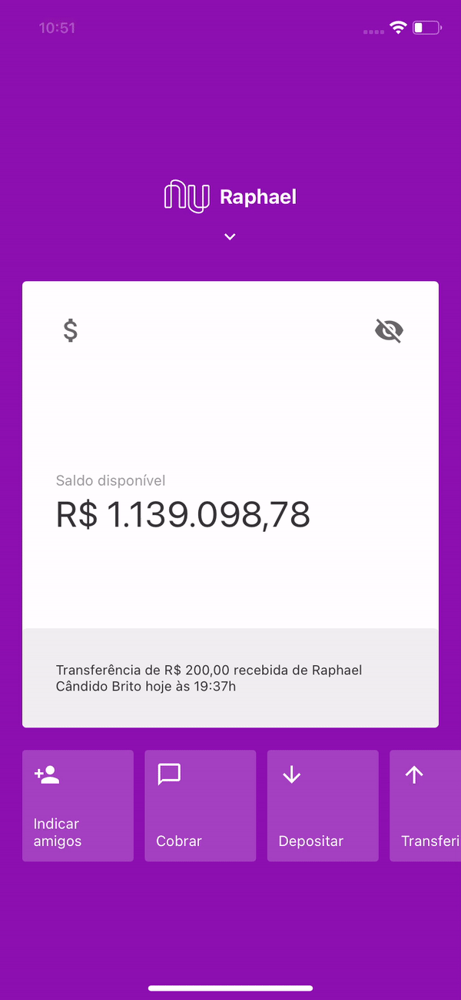

<h3 align="center">
    
     
     
</h3>

Aplicação desenvolvida para refletir a interface da tela inicial do App do Nubank.

## 💻 About this project

RaphaBrito/nubank - É uma aplicação que foi criada com a intenção de estudar a construção de layouts em [React Native][react] que contém animações e utilizam QR Codes. 

### Pré-requisitos

Este projeto foi desenvolvido utilizando o template de configuração de ambiente da Rocketseat.
É ideal que você tenha o ambiente configurado para criar e testar aplicativos em React Native, para isso você pode seguir o guia do link abaixo:

[Ambiente React Native (Android/iOS)](https://react-native.rocketseat.dev/)

## 🎨 Layout da Aplicação

O layout da aplicação é exatamente o layout do aplicativo do Nubank, utilizado com o objetivo principal de estudar animações.

## 🛠 Tecnologias

O que utilizamos para desenvolver o projeto?

- [React Native][react] - React Native é uma biblioteca Javascript criada pelo Facebook. É usada para desenvolver aplicativos para os sistemas Android e iOS de forma nativa.
- [JavaScript][javascript] - é uma linguagem leve, interpretada e baseada em objetos com funções de primeira classe, mais conhecida como a linguagem de script para páginas Web.

## 📝 Licença

O projeto utiliza a licença [MIT][license].

## Contato

Raphael Brito - [Github](https://github.com/raphabrito) - **contato@raphaelbrito.com**

[javascript]: https://developer.mozilla.org/pt-BR/docs/Web/JavaScript
[react]: https://reactnative.dev/
[license]: https://opensource.org/licenses/MIT
